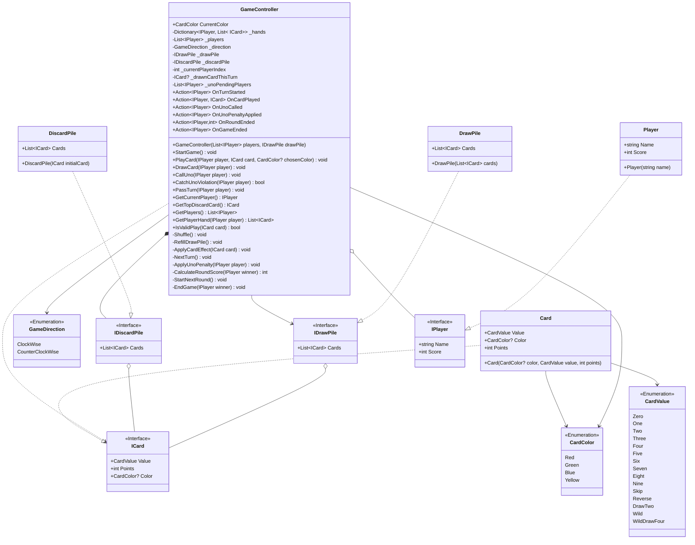

```mermaid
classDiagram
direction TB
    class CardValue {
	    Zero
	    One
	    Two
	    Three
	    Four
	    Five
	    Six
	    Seven
	    Eight
	    Nine
	    Skip
	    Reverse
	    DrawTwo
	    Wild
	    WildDrawFour
    }

    class CardColor {
	    Red
	    Green
	    Blue
	    Yellow
    }

    class Card {
	    +CardValue Value
	    +CardColor? Color
        +int Points
	    +Card(CardColor? color, CardValue value, int points)
    }

    class ICard {
	    +CardValue Value
        +int Points
	    +CardColor? Color
    }

    class GameDirection {
	    ClockWise
	    CounterClockWise
    }

    class IDiscardPile {
        +List~ICard~ Cards
        %% +AddCard(ICard card) void
        %% +ViewTopCard() ICard
        %% +PopAllExceptTop() List~ICard~
    }

    class IDrawPile {
        +List~ICard~ Cards
        %% +DrawCard() ICard
        %% +Shuffle() void
        %% +IsEmpty() bool
        %% +Refill(List~ICard~ newCards) void

    }

    class DrawPile {
	    +List~ICard~ Cards
        +DrawPile(List~ICard~ cards)
        %% +DrawCard() ICard
        %% +Shuffle() void
        %% +IsEmpty() bool
        %% +Refill(List~ICard~ newCards) void
    }

    class DiscardPile {
	    +List~ICard~ Cards
        +DiscardPile(ICard initialCard)
        %% +AddCard(ICard card) void
        %% +ViewTopCard() ICard
        %% +PopAllExceptTop() List~ICard~
    }

    class IPlayer {
        +string Name
        +int Score
        %% +IReadOnlyList~ICard~ Hand
        %% +List~ICard~ Hand
        %% +AddToHand(ICard card) void
        %% +RemoveFromHand(ICard card) void
    }

    class Player {
        +string Name
        +int Score
        %% +IReadOnlyList~ICard~ Hand
        %% +List~ICard~ Hand
        +Player(string name)
        %% +AddToHand(ICard card) void
        %% +RemoveFromHand(ICard card) void
    }
    
    class GameController{
        +CardColor CurrentColor
        -Dictionary~IPlayer, List< ICard>~ _hands
        -List~IPlayer~ _players
        -GameDirection _direction
        -IDrawPile _drawPile
        -IDiscardPile _discardPile
        -int _currentPlayerIndex
        -ICard? _drawnCardThisTurn
        -List~IPlayer~ _unoPendingPlayers
        +Action~IPlayer~ OnTurnStarted
        +Action~IPlayer, ICard~ OnCardPlayed
        +Action~IPlayer~ OnUnoCalled
        +Action~IPlayer~ OnUnoPenaltyApplied
        +Action~IPlayer,int~ OnRoundEnded
        +Action~IPlayer~ OnGameEnded

        +GameController(List~IPlayer~ players, IDrawPile drawPile)
        +StartGame() void

        +PlayCard(IPlayer player, ICard card, CardColor? chosenColor) void
        +DrawCard(IPlayer player) void
        +CallUno(IPlayer player) void
        +CatchUnoViolation(IPlayer player) bool
        +PassTurn(IPlayer player) void

        +GetCurrentPlayer() IPlayer
        +GetTopDiscardCard() ICard
        +GetPlayers() List~IPlayer~
        +GetPlayerHand(IPlayer player) List~ICard~
        +IsValidPlay(ICard card) bool

        -Shuffle() void
        -RefillDrawPile() void
        -ApplyCardEffect(ICard card) void
        -NextTurn() void
        -ApplyUnoPenalty(IPlayer player) void
        -CalculateRoundScore(IPlayer winner) int
        -StartNextRound() void
        -EndGame(IPlayer winner) void
    }

	<<Enumeration>> CardValue
	<<Enumeration>> CardColor
	<<Interface>> ICard
	<<Enumeration>> GameDirection
	<<Interface>> IDiscardPile
	<<Interface>> IDrawPile
    <<Interface>> IPlayer

    Card ..|> ICard
    Card --> CardColor
    Card --> CardValue

    %% ICard ..> IDrawPile
    %% ICard --> DiscardPile

    GameController --> CardColor
    GameController --> GameDirection
    GameController --> IDrawPile
    GameController *-- IDiscardPile
    GameController o-- IPlayer
    GameController ..> ICard

    Player ..|> IPlayer
    %% IPlayer o-- ICard
    %% IDrawPile *-- ICard
    %% IDrawPile -- IDiscard
    %% IDiscardPile *-- ICard
    
    IDiscardPile o-- ICard
    DiscardPile ..|> IDiscardPile

    %% DrawPile --> ICard
    %% DrawPile o-- ICard

    IDrawPile o-- ICard
    
    DrawPile ..|> IDrawPile
```